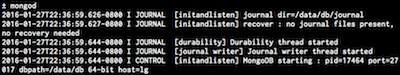
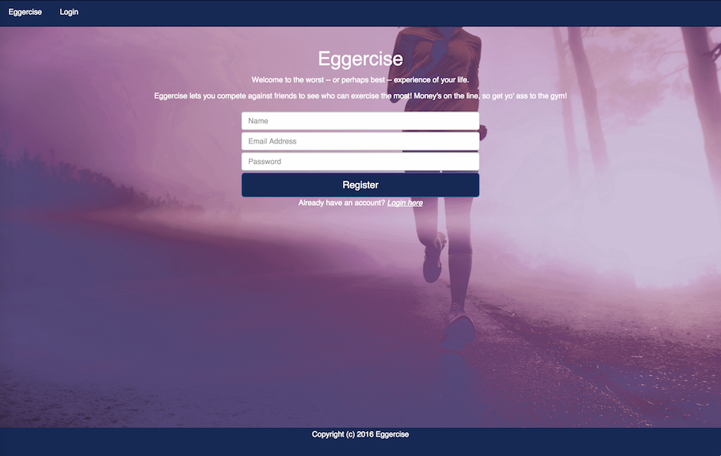
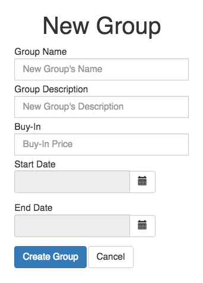
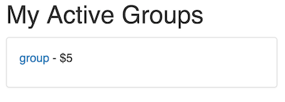
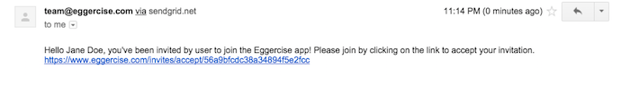
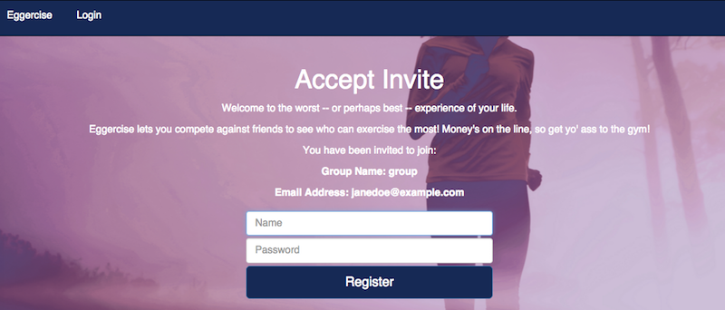
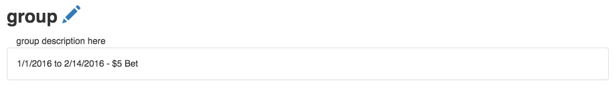
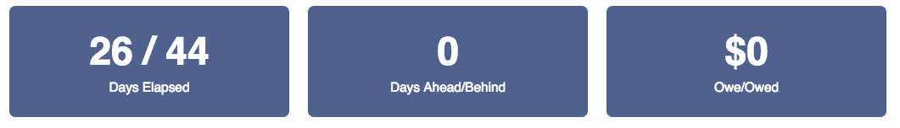
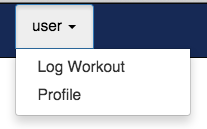
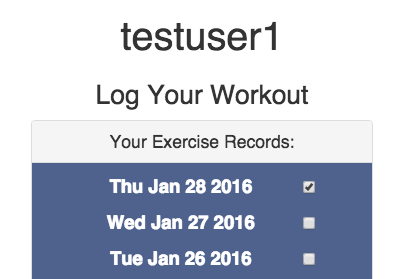

# Eggercise   

An application for motivating people to exercise by incentivizing them with the two true incentives in life: pride and money.

## Technology Stack

* MongoDB with Mongoose
* Node with Express
* Angular

## Setup (Please follow in order)

* Git clone the repo
* Checkout the dev branch
* Make sure you are in the root folder of the eggercise directory, which is 'eggercise'.
* Install npm if you haven't. Follow instrucions [here](https://docs.npmjs.com/getting-started/installing-node)
* Install MongoDB, Follow instructions [here](https://www.npmjs.com/package/mongodb)
* npm install
* bower install
* Navigate to the /eggercise/server folder and run `jasmine init` (this is for setting up server side specs)
* Navigate to the /eggercise folder and run `gulp serve`

At this point, you should have the app setup complete.

#### Running the App

* Open a new terminal window and run the command 'mongod'.
* You should now see that Mongo server is running

* Open another terminal window and run the command 'gulp serve' to have the server running.
* With default settings, the app should automatically pop up in a new web browser window.
* (Skip this if previous step was successful) If not, open a new web browser window and in the URL bar, type in 'localhost:3000'. This should redirect you to the landing page of the app.
* You should see the landing page as shown below:

#### Tests for MongoDB and AngularJS

###### Running MongoDB Tests (Server Side)

* Open a new terminal window, and navigate to 'server' folder.
* There are 6 spec folders, one each for user, group, invite, auth, email, and error.
* In order to run the specs, run the command 'NODE_ENV=test jasmine spec/_path_to_directory/filename'.
* There is a total of 6 specs (including controllers and models) in the server side. You can run one spec file at a time. For example, if you want to run the spec for group controller, you would type in the command: 'NODE_ENV=test jasmine spec/api/group/group.controller.spec.js'
* This will run the test suite within the test database named 'eggercise-test'.

***WARNING: You cannot run the specs while the actual server is running. Terminate the server to run the spec files (Ctrl + C if server is running)

###### Running Angular Test (Client Side)

* Open a new terminal window, and navigate to 'client' folder.
* Simply run the command 'gulp test' in the terminal.

## Using Eggercise

Welcome to Eggercise! If you are a new user, you need to register with us. Once you register, you will be directed to your groups page and you will see that you currently have no workout groups. Feel free to make one. Simply click on the 'add group' button.

You will now see a field that you should fill out to determine important details of the group, such as the start and end date of the group. Fill them out as you would like to.

After you are done filling them out, click the 'create group' button. Now you should be back in the page that shows your groups, with the group you just created in the list of Active Groups.

If you visit that group, you will see that group's details, such as the start date, end date, how much each person owes/ is owed, etc. But oh wait, you are the only one in the group, so no one owes you anything, nor do you owe anyone anything. So why don't we make this more fun and invite a friend? Or an enemy. Your choice. Look at the very bottom of the groups page.

Go ahead and fill out your potential group member's name and e-mail, then click the 'send invitation' button. They should have gotten an e-mail from 'team@eggercise.com', which includes a greeting and a link to accepting the invitation to that group, like the following screenshot:

But oh wait, your invitees don't have an account in Eggercise. No worries, because after they click the invitation link, they just need to type in the username and password in order to register. We already have their e-mail:

As soon as they register, they will be registered as a member of your group and you are not alone anymore.

So now that you have a group with your friends as members, let's dive into the actual features of this app. Look at the left top corner of the group's page. The 'days elapsed' show how many days have passed since the group's start date until now. On the right side of that number, is another number separated by a '/', which shows for how many days total the group is active:

Next to the pair of numbers, you will see another number, with the label 'days behind' or 'days ahead' below it. That shows how many days you are ahead if you are the leader of the group, or how many days behind if you are not the leader of the group.

If you are the leader, you win all of the money in the betting pool. If not, you will have to pay the leader, the amount depending on how behind you are from the leader. We calculate it for you in the third block:

So wait, how do you become a leader of the group? It's simple. You just need to workout more than the rest of the group members, and log the days that you worked out. In order for you to log your workout, you can click on your name on the navigation bar. Then you will see a 'Log Workout' option that you can click:

This option will lead you to a page where you can log the days you worked out. The dates you can log will vary, depending on when you registered for the app and when the earliest start date among your groups is. Simply click the checkbox next to the date you worked out on, and congratulations! You just logged a workout!

Repeat this every day and hopefully, one day you will overthrow all of the leaders in your group and become rich. Until then, keep on Eggercising!
